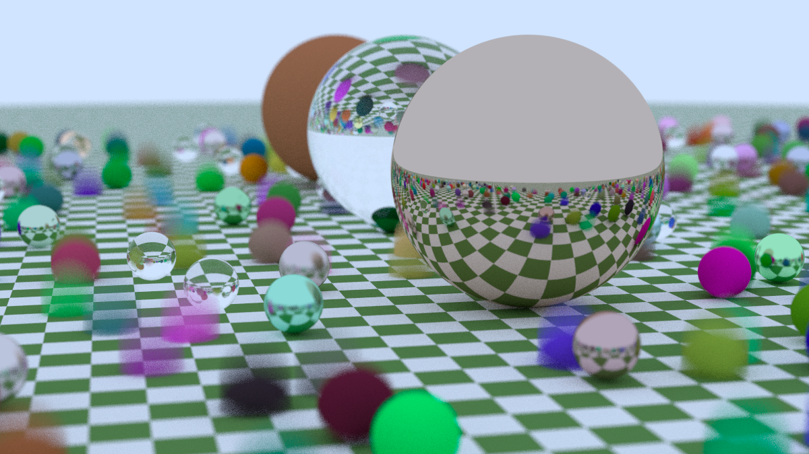

# Ray Tracing In One Weekend (C#)
A CPU-based C# / .NET 6 port of Peter Shirley's C++ ray tracing series:\
[_Ray Tracing in One Weekend_](https://raytracing.github.io/books/RayTracingInOneWeekend.html)\
[_Ray Tracing: The Next Week_](https://raytracing.github.io/books/RayTracingTheNextWeek.html)

Like the original a scene can be selected in the Main method of [Progam.cs](RayTracingInOneWeekend/Program.cs) and output piped to a PPM file, e.g: `RayTracing.exe > image.ppm`

## Improvements
- Parallelisation of the main loop via [Parallel.For](https://docs.microsoft.com/en-us/dotnet/api/system.threading.tasks.parallel.for?view=net-5.0)
- SIMD-acceleration via the [Vector3](https://docs.microsoft.com/en-us/dotnet/api/system.numerics.vector3?view=net-5.0) class provided by [System.Numerics](https://docs.microsoft.com/en-us/dotnet/api/system.numerics?view=net-5.0) 

## TODOs
- Implement the changes in [_Ray Tracing: The Rest of Your Life_](https://raytracing.github.io/books/RayTracingTheRestOfYourLife.html)
- Create a GPU-based implementation.
- Meaningful rename for some properties.
- Documentation!

## Example Renders

